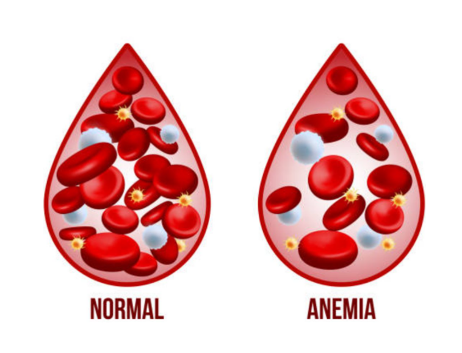
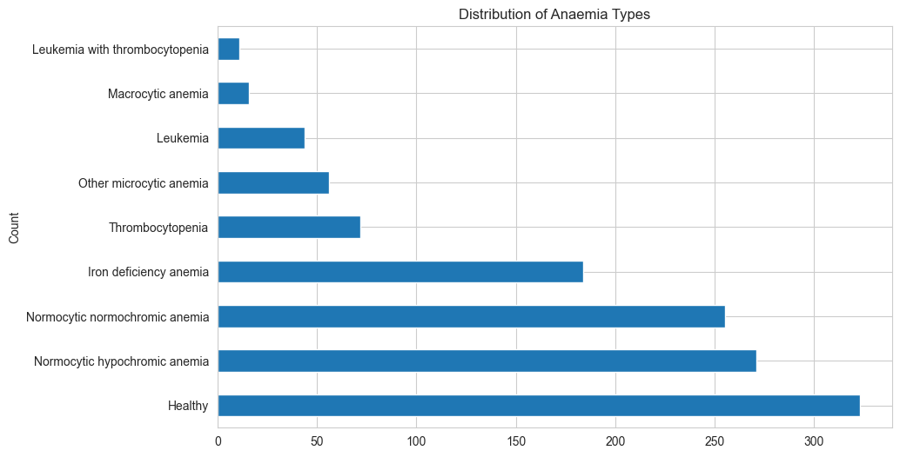
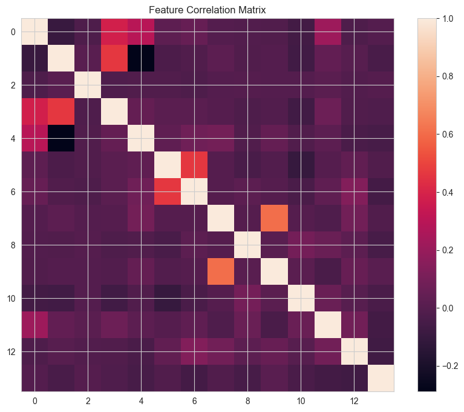
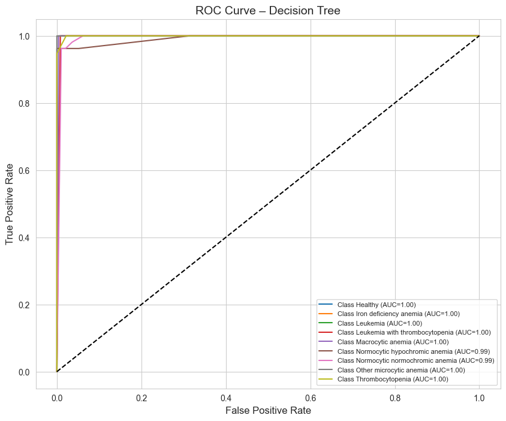
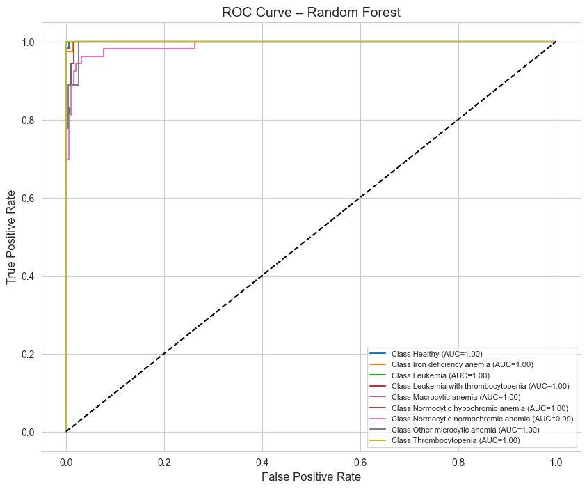
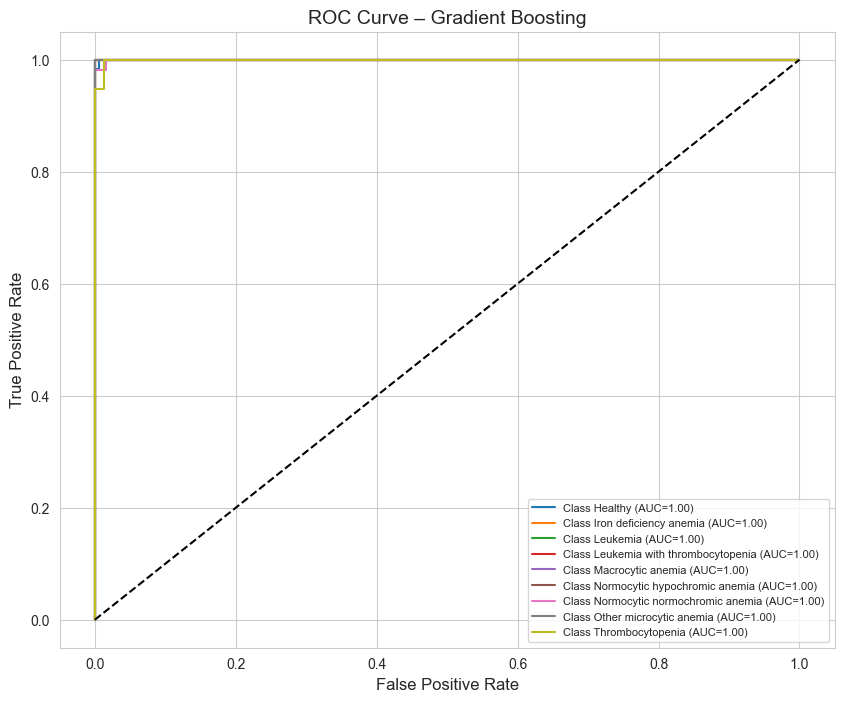

# Early Detection of Anaemia
This project builds classification models that predict the occurrence of anaemia in patients given some CBC values, allowing early detection.

---


## Background
Anaemia is a common blood disorder that affects millions of people worldwide. It occurs when the body does not have enough healthy red blood cells or haemoglobin to carry oxygen effectively. Early detection of anaemia is important because untreated cases can lead to fatigue, organ damage, complications in pregnancy, and reduced quality of life.  

Traditionally, anaemia is diagnosed through laboratory blood tests and manual interpretation by medical professionals. While these methods are reliable, they can be time-consuming and may not always provide fast support for early screening, especially in resource-limited settings. With the increasing availability of medical data, machine learning models can analyse multiple blood parameters at the same time and learn complex relationships that may not be obvious through manual analysis. This can help in detecting anaemia earlier, classifying its type more accurately, and supporting clinical decision-making.

---

## Objective of study
To determine how accurately algorithms such as Logistic Regression, Support Vector Machines, Random Forest, Decision Tree, and Gradient boosting can identify distinct types of anaemia as well as distinguish them from healthy cases. By analysing key blood parameters, the study seeks to understand the ability of these models to support faster and more reliable screening. 

---

## Dataset Summary
- Records: 1,281
- Features: 15
- Target Variable: Diagnosis
- Duplicates: 49 records (Dropped)
- Missing: None

---

## Models Trained & Compared
The following 5 models were evaluated:
- Logistic Regression
- Decision Tree Classifier
- Random Forest Classifier
- Support Vector Classifier (SVC)
- Gradient Boosting Classifier

---

## Key Insights 
#### Exploratory Data Analysis (EDA)
- An evaluation of the distribution of anaemia types reveals a class imbalance, with certain anaemia categories being well represented while others have relatively few samples.
  - This imbalance can make it more challenging for the model to learn and accurately predict rare conditions.
  - To address this issue, class weighting and detailed per-class performance evaluation are applied to ensure that the model performs effectively across both common and less frequent anaemia types.



- The correlation matrix indicates that most blood-related features exhibit low to moderate correlations with one another.
  - This suggests they capture distinct and complementary information rather than redundant signals.
  - As a result, the models are able to learn from multiple informative features, with minimal risk of instability arising from highly correlated inputs.  



- The ANOVA test was used to determine whether there are statistically significant differences (p < 0.05) in the means of each numerical blood parameter across the different anemia types.
  - The features below showed mean values which differ significantly between at least some of the anemia groups. This means these features are likely to be useful for distinguishing between anemia types, as their distributions are not the same across all groups.
  - These blood parameters are important candidates for further analysis and for building predictive models, as they capture differences between anemia types.
  - The results also support the use of these features in machine learning models for anemia classification, and may also provide clinical insight into which blood parameters are most relevant for distinguishing between different forms of anemia.
```
WBC: p = 2.8672e-35
LYMp: p = 4.4059e-07
NEUTn: p = 4.8108e-28
RBC: p = 3.1247e-04
HGB: p = 3.0650e-52
MCV: p = 1.2459e-18
MCHC: p = 5.6304e-44
PLT: p = 3.5857e-82
PDW: p = 1.1302e-04
PCT: p = 8.2595e-04
```

#### Pre-processing
- During exploratory analysis, 49 duplicate records were identified and removed, as they accounted for less than 5% of the total data and could have negatively impacted model performance.
- The categorical class labels were then encoded into numerical values to ensure compatibility with machine learning algorithms.
- Subsequently, the data was split into training and testing sets to enable objective model evaluation.
- Finally, feature scaling was performed using standardization so that all numerical features contributed equally to the learning process, which is particularly important for distance-based models such as Support Vector Machines (SVM).


#### Modelling
- A total of five (5) models were assessed (Logistic Regression, Decision Tree Classifier, Random Forest Classifier, Support Vector Classifier, and Gradient Boosting Classifier).
- Both Logistic Regression and Support Vector Machine models achieved good performance, but their effectiveness improved significantly after hyperparameter tuning.
- Tree-based models (Decision Tree, Random Forest, and Gradient Boosting) performed competitively, with Random Forest and Gradient Boosting often matching or exceeding the accuracy of Logistic Regression and SVM, especially in handling class imbalance and capturing complex feature interactions. Their ROC curves showed strong separability for most anaemia types, with Random Forest and Gradient Boosting providing robust AUC values across all classes.  

  

  




- The ROC results for these models confirm their reliability: ensemble methods like Random Forest and Gradient Boosting consistently achieve high AUC values, indicating strong discrimination between anaemia types. Their performance is robust even without tuning, making them practical choices for clinical applications where rapid deployment and interpretability are important.


## Conclusion
Our findings suggest that machine learning, particularly ensemble tree-based models and SVM, has strong potential to support early anaemia screening and assist healthcare professionals in making faster and more consistent diagnostic decisions. The use of class weighting and careful model selection ensures that minority conditions are detected with good sensitivity, and the consistency between cross-validation and test performance indicates good generalization ability.


## Repository Structure
```
├── data/
├── img/
├── notebooks/
│   ├── anemia_prediction.ipynb
├── README.md
├── .gitignore
```
